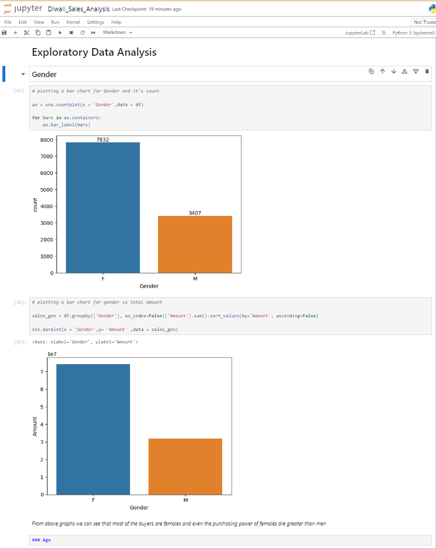
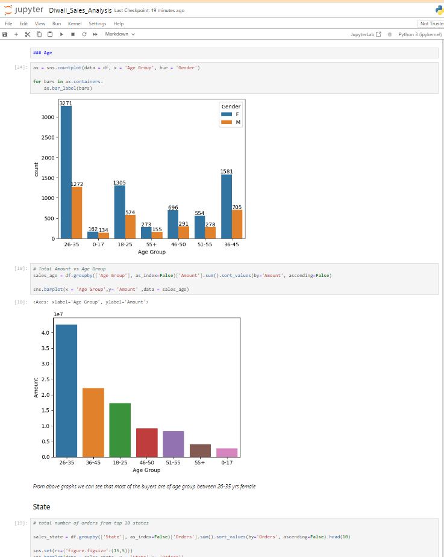
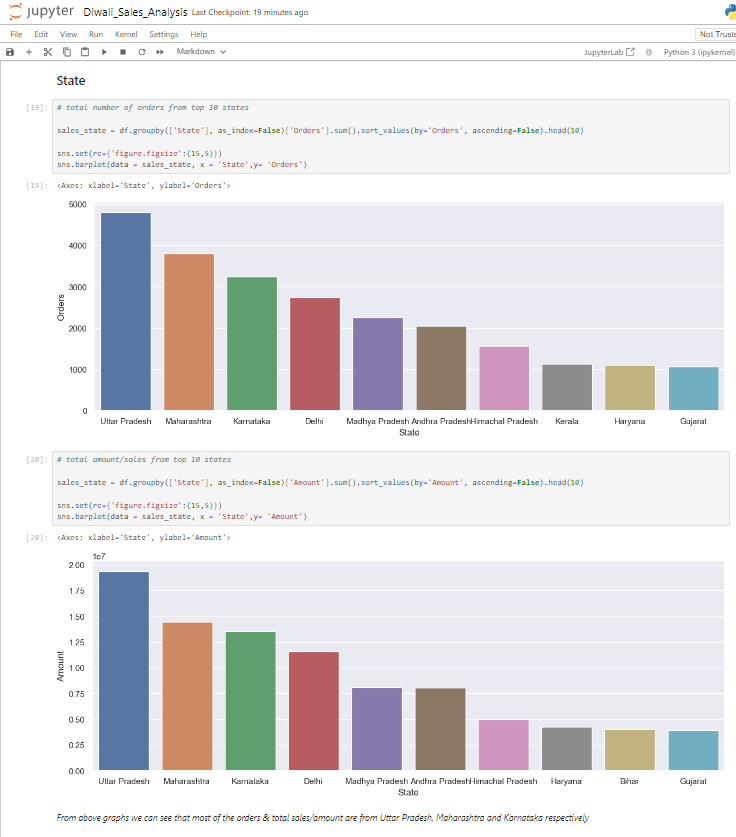
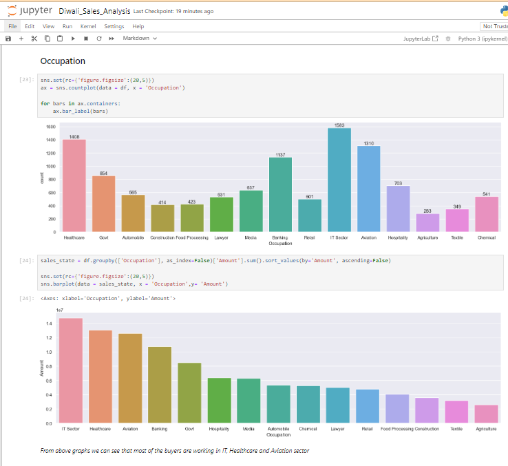

# 🪔 Diwali Sales Data Analysis using Python

This project analyzes Diwali sales data using Python to derive business insights and customer behavior patterns. It demonstrates end-to-end data cleaning, visualization, and exploratory analysis using **pandas** and **matplotlib** .

## 📁 Project Structure

```
Python-Diwali-Salesboard/
├── Diwali_Sales_Data.csv         # Raw sales data
├── diwali_sales_analysis.ipynb   # Jupyter notebook with analysis
├── output/                       # Generated plots 
└── README.md                     # Project documentation
```

## 📊 Key Insights Covered

- Gender-wise and age-wise customer spending
- State-wise revenue distribution
- Occupation and marital status impact on sales
- Product category trends and sales patterns

## 🖼️ Dashboard Previews

<p align="left">
  <strong>Gender-based sales</strong><br>
  
  &nbsp;&nbsp;
  
  <strong>Age-based sales</strong><br>
  
</p>

<br>

<p align="left">
  <strong>State-based performance</strong><br>
  
  &nbsp;&nbsp;
  
  <strong>Occupation-based performance</strong><br>
  
</p>

## ⚙️ Tech Stack

- **Language**: Python 3
- **Libraries**: Pandas, Matplotlib, Jupyter Notebook
- **Tools**: VS Code / JupyterLab

## 🚀 How to Use

### 1. Clone the Repository

```bash
git clone https://github.com/richanshu14/Python-Diwali-Salesboard.git
cd Python-Diwali-Salesboard
```

### 2. Install Required Libraries

```bash
pip install pandas matplotlib 
```

### 3. Run the Notebook

```bash
jupyter notebook diwali_sales_analysis.ipynb
```

Explore the notebook step-by-step for cleaning, EDA, and visualization.


## 📌 Use Cases

- Beginner-level data analysis project
- Portfolio project to showcase EDA skills
- Retail domain data analysis practice

## 🧑‍💻 Author

**Richanshu Yadav**  
[GitHub Profile](https://github.com/richanshu14)

